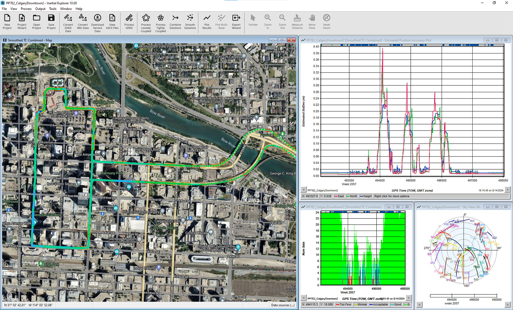

.. _GNSS.2FSPAN_Data_Post-Processing:

GNSS/SPAN Data Post-Processing
==============================

Once you have captured NovAtel logs in a ROS bag file using novatel_oem7_driver, you can use NovAtel Application Suite or Inertial Explorer to analyze or post-process your data and thus extend its usefulness beyond real-time operation.

The NovAtel log format is open and public, so it is also possible to use programs like Microsoft Excel, MathWorks Matlab, or software of your own design to quickly and easily evaluate and visualize the data.
For more information about the structure of NovAtel logs, please refer to our Documentation Portal `here <https://docs.novatel.com/OEM7/Content/Logs/OEM7_Core_Logs.htm>`__.

You can also use `NovAtel EDIE <https://novatel.com/products/firmware-options-pc-software/encode-decode-interface-engine-software-development-kit>`__ to aid in the decoding of logs that you can integrate into your own solutions:

.. _NovAtel_Application_Suite:

NovAtel Application Suite
-------------------------

NovAtel Application Suite is a desktop application that NovAtel provides for free.

NovAtel Application Suite (NAS) can:

-  Convert OEM7 log data to ASCII, RINEX or KML formats

-  Filter NovAtel logs to output only the data the user wants

-  Filter data by time (specify a range of date/times to output data
   for)

There are versions of NovAtel Application Suite for Windows and Linux. NovAtel Application Suite also offers a command-line interface, so users may use it to script or otherwise automate the conversion of log data through it.

`https://docs.novatel.com/Tools/Content/Convert/CLI_Options.htm <https://docs.novatel.com/Tools/Content/Convert/CLI_Options.htm>`__

.. _Download_NAS_for_Windows_or_Linux:

Download NAS for Windows or Linux
~~~~~~~~~~~~~~~~~~~~~~~~~~~~~~~~~

NovAtel Application Suite is a free software provided by NovAtel. It can be downloaded `here <https://novatel.com/support/support-materials/software-downloads>`__.

.. _Convert_Command-Line_Use:

NovAtel Application Suite Command-Line Use
~~~~~~~~~~~~~~~~~~~~~~~~~~~~~~~~~~~~~~~~~~

NovAtel Application Suite's ``--help`` argument will output the full help text that describes how to use it from the command-line.

.. _NAS_Convert_GUI_Use:

NAS Convert GUI Use
~~~~~~~~~~~~~~~~~~~

The NovAtel Application Suite graphical interface is launched by running it
without any command-line arguments.

The general workflow of the Convert GUI is:

-  Launch the GUI

-  Select the Convert Utility

-  Drag and drop your data from ``/novatel/oem7/oem7raw``

-  Select the NovAtel logs you are interested in then select Next

-  Select your desired output formats (ASCII, Binary, KML, RINEX,...) and modify any other relevant settings

-  Click Convert to convert your input data in to the selected output
   data type

.. note::
   The topic oem7raw is required to use this utility.
   It must be properly extracted from the bag so that the data bytes are concatenated across each message in order.
   It is highly recommended to always collect oem7raw for troubleshooting purposes

--------------

.. _Inertial_Explorer_and_Inertial_Explorer_Xpress:

Inertial Explorer and Inertial Explorer Xpress
----------------------------------------------

NovAtel's Waypoint group produces Inertial Explorer and Inertial Explorer Xpress.
These desktop applications provide extensive, easy-to-use and highly advanced data post-processing abilities.
Use Inertial Explorer to pull-in base station RTK data and reprocess your recorded GNSS/INS data.
Inertial Explorer can process data sets in forward and reverse time to close gaps and reduce error in GNSS/INS data sets.

There is a Linux CLI of Inertial Explorer also available.

Please request a demo to try Inertial Explorer:
`https://novatel.com/contactus/request-a-trial <https://novatel.com/contactus/request-a-trial>`__

.. _Inertial_Explorer_Linux_SDK:

Inertial Explorer Linux SDK
~~~~~~~~~~~~~~~~~~~~~~~~~~~

There is a Linux SDK edition of Inertial Explorer available, please contact `NovAtel Customer Support <https://shop.novatel.com/s/contactsupport>`__ to request a demo:

.. _More_information_on_Inertial_Explorer:

More information on Inertial Explorer
~~~~~~~~~~~~~~~~~~~~~~~~~~~~~~~~~~~~~

For more information regarding Inertial Explorer and Inertial Explorer Xpress, please visit:
- `https://novatel.com/products/waypoint-post-processing-software/inertial-explorer <https://novatel.com/products/waypoint-post-processing-software/inertial-explorer>`__
- `https://novatel.com/products/waypoint-post-processing-software/inertial-explorer-xpress <https://novatel.com/products/waypoint-post-processing-software/inertial-explorer-xpress>`__
