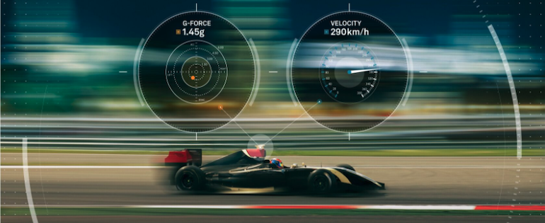
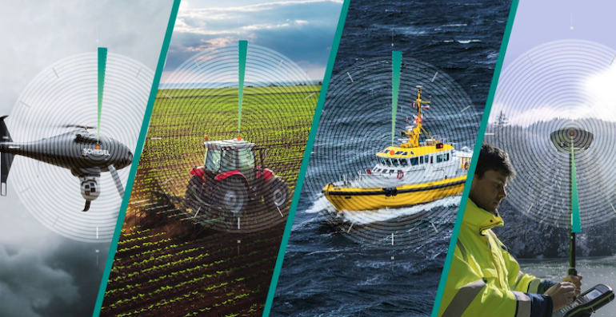

.. _ROS_Relevant_NovAtel_Products_and_Services:

ROS Relevant NovAtel Products and Services
==========================================

Hexagon | NovAtel offers a wide range of products and services of
great potential value to ROS users in addition to the novatel_oem7_driver.

--------------

.. _OEM7_GNSS_Receivers:

OEM7 GNSS Receivers
-------------------

NovAtel creates world-class GNSS systems that can track constellations
including:

-  GPS
-  Glonass
-  Galileo
-  Beidou
-  QZSS

The OEM7 GNSS product line from NovAtel offers further advanced options including:

-  On-board OEM7 API (Lua Interpreter)

-  Interference Detection and Mitigation

-  Real-Time correction services via TerraStar or
   Oceanix

-  Multi-Antenna Heading Support

-  Multi-channel, Multi-signal band tracking with 555 channels

-  SBAS support

More information is available `here <https://novatel.com/products/receivers>`__.

--------------

.. _OEM7_SPAN_Systems:

OEM7 SPAN Systems
-----------------

NovAtel's SPAN systems add transparent Inertial Measurement Unit (IMU) fusion with GNSS-driven positioning to provide resilient position, velocity and attitude solutions, even through GNSS disruptions.
NovAtel's SPAN profiles allow a next-level degree of accuracy.

For more information, please refer `here <https://novatel.com/products/gnss-inertial-navigation-systems>`__.

--------------

.. _SMART_Antennas:

SMART Antennas
--------------

NovAtel SMART antennas are high precision products that include a board level GNSS receiver, a GNSS antenna, and an IMU (optional) integrated into one compact enclosure.

For more information, please refer `here <https://novatel.com/products/gps-gnss-smart-antennas>`__.

--------------

.. _Correction_Services:

Correction Services
-------------------

NovAtel offers Precise Point Positioning (PPP) Correction Services for land, airborne or marine applications.

For more product information, please refer `here <https://novatel.com/products/correction-services>`__.

--------------

.. _Post-Processing_Solutions:

Post-Processing Solutions
-------------------------

Try Waypoint software for applications requiring highly accurate post-mission position, velocity or attitude.

For more information, please refer `here <https://novatel.com/products/waypoint-post-processing-software>`__.

--------------

.. _NovAtel_Applications_Engineering:

NovAtel Applications Engineering
--------------------------------

NovAtel's Applications Engineering team offers world-class technical and integration support for NovAtel's products and services.
Feel free to reach out to this team if you need help with your OEM7 product:

`https://shop.novatel.com/s/contactsupport <https://shop.novatel.com/s/contactsupport>`__
