.. _Topic_Mapping_and_Sourcing:

ROS2 Topic Mapping
==================

.. _Overview:

Overview
--------

This page provides an overview and description of how NovAtel receiver logs are mapped to ROS2 topics.
This information can be useful for troubleshooting or to help understand where values in the novatel_oem7_driver are being populated from.

Please note that source should be treated as the most up to date information on how topics are mapped to NovAtel logs.

.. _ROS2_Driver_Topic_Mapping:

ROS2 Driver Topic Mapping
-------------------------

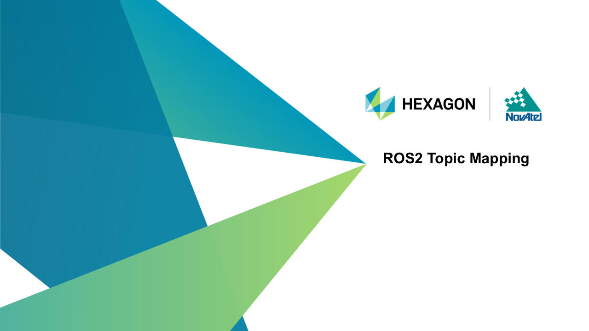
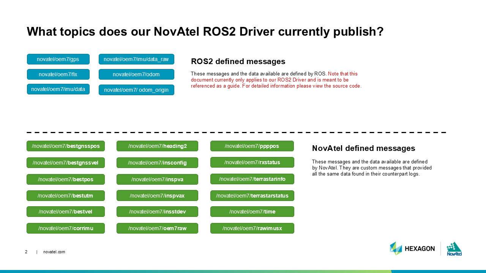
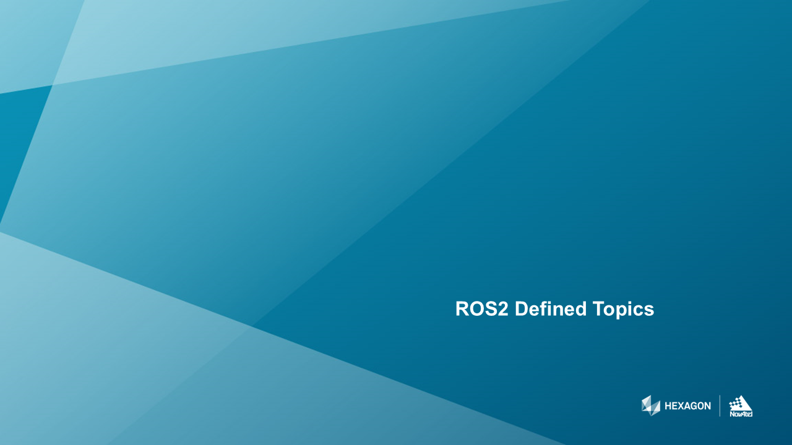
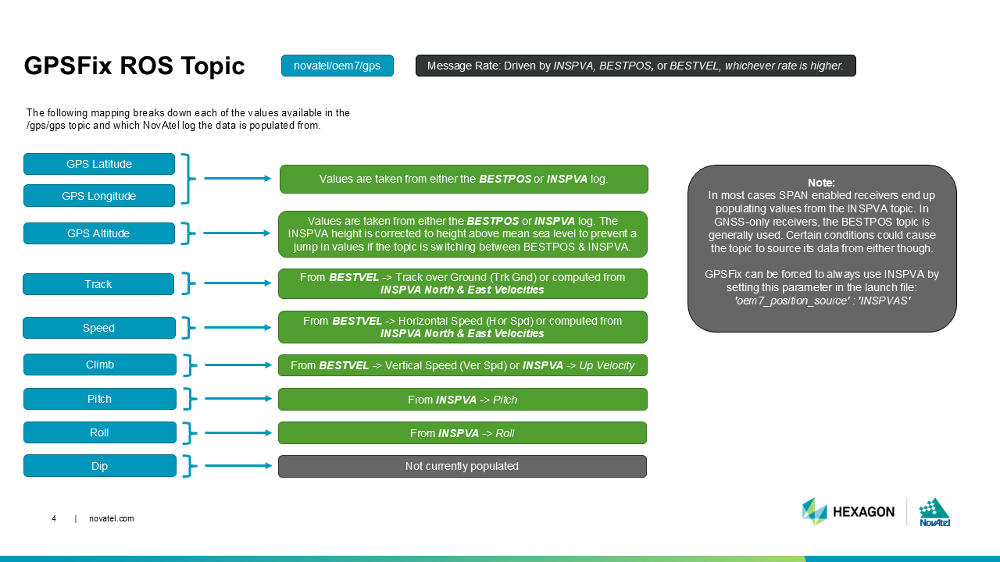
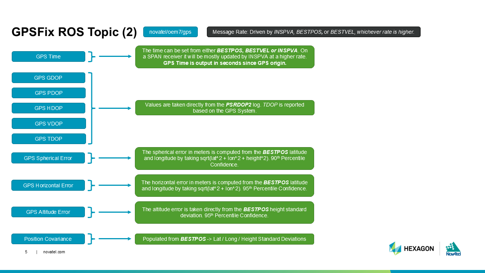
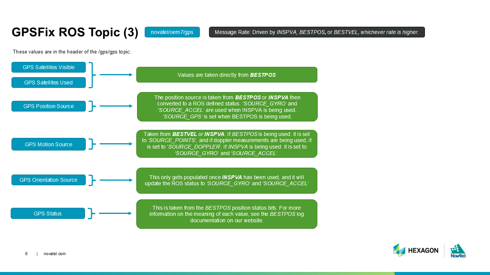
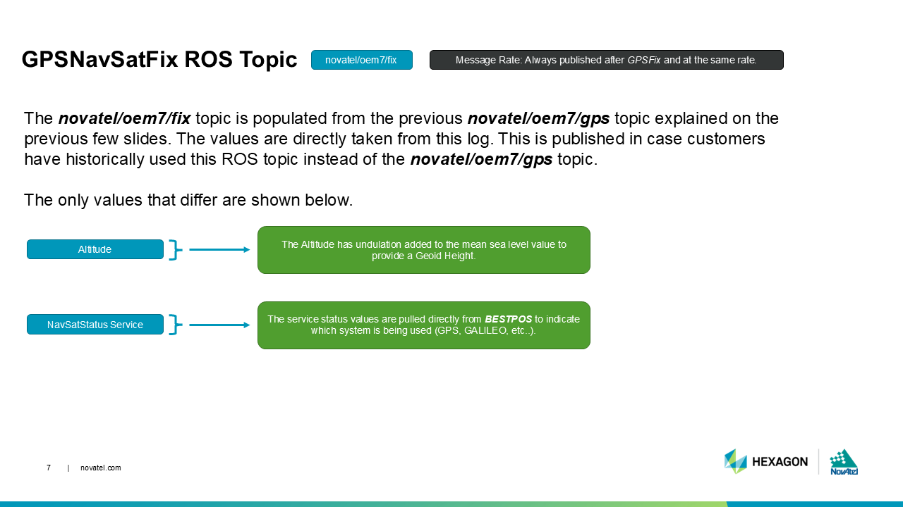
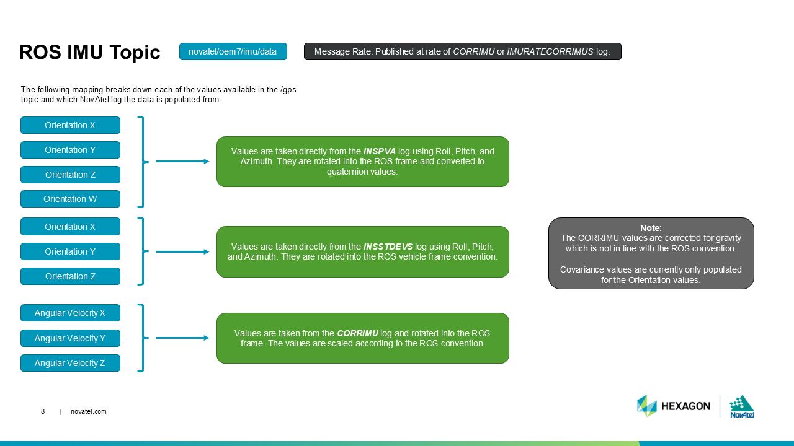
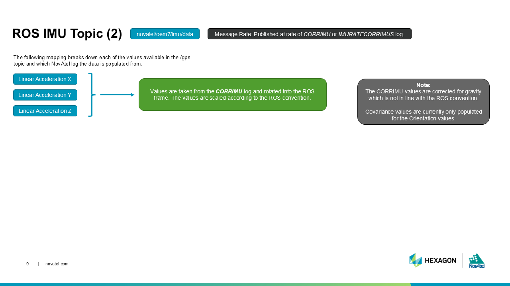
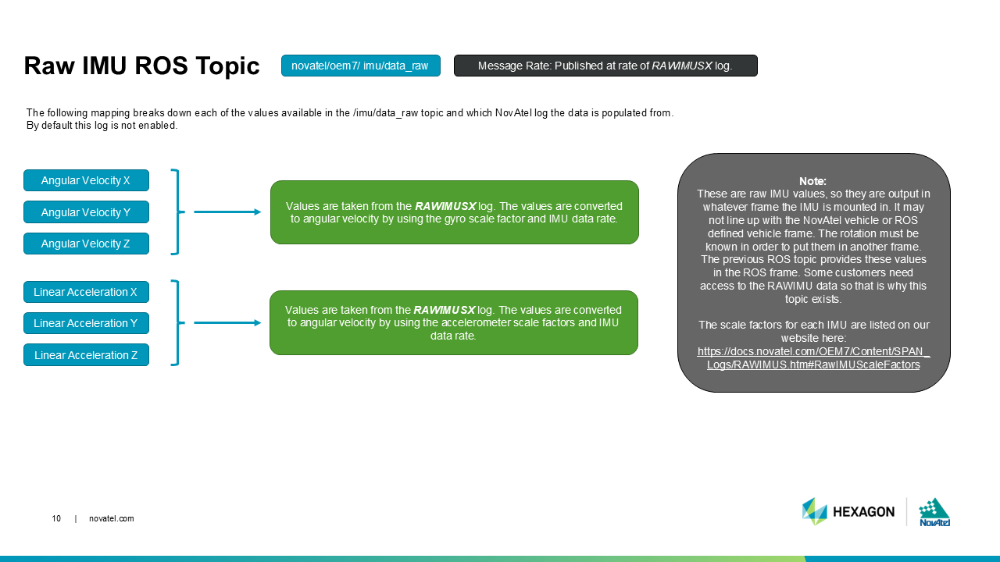
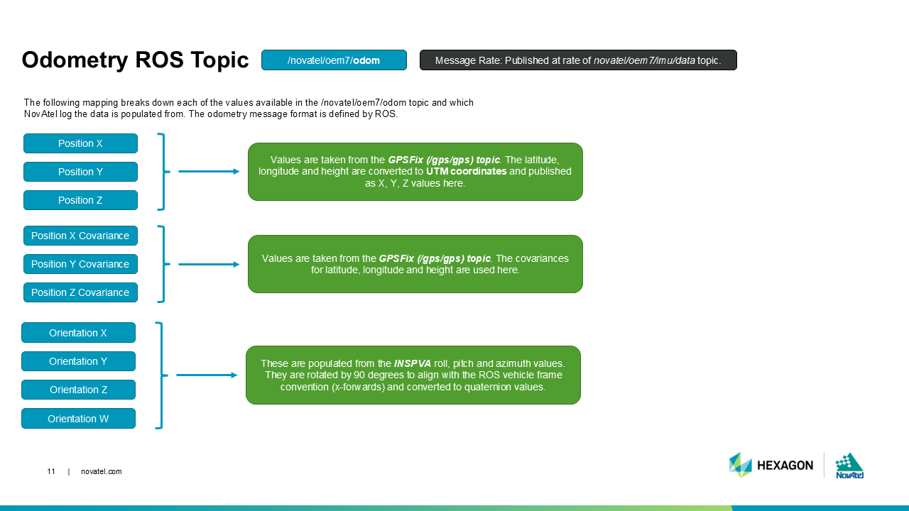
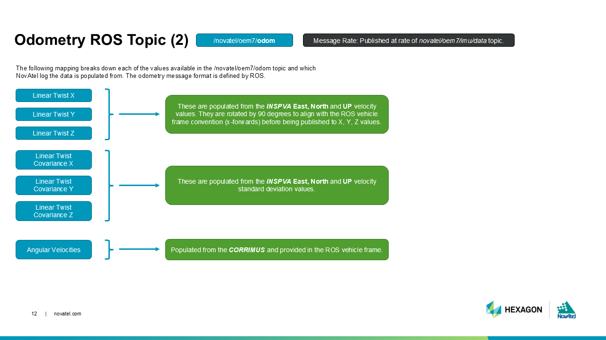
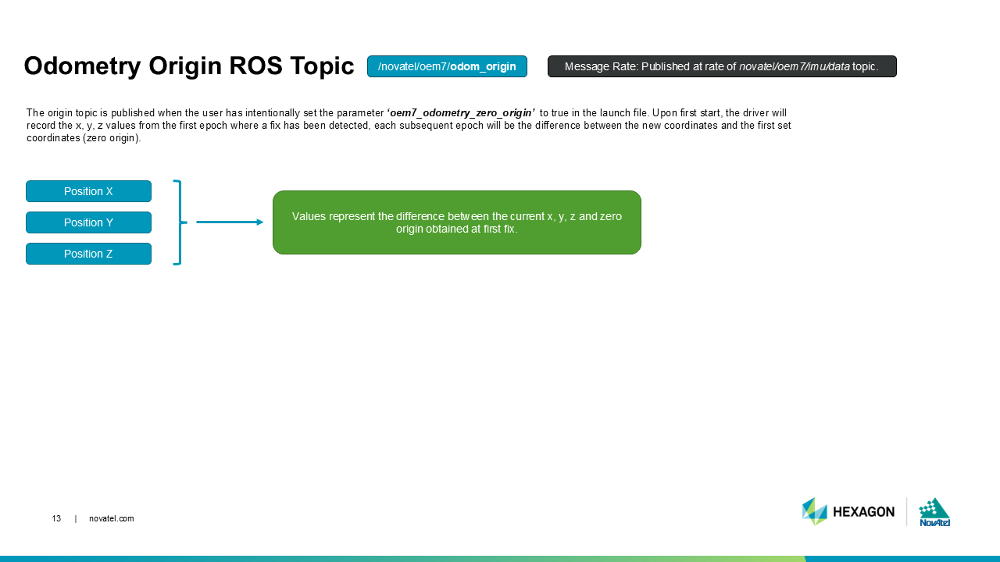
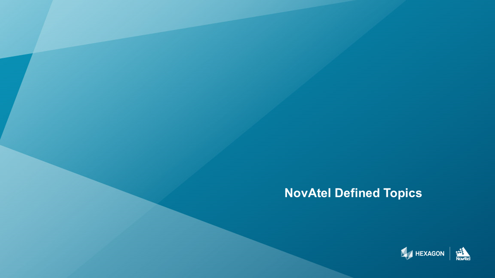
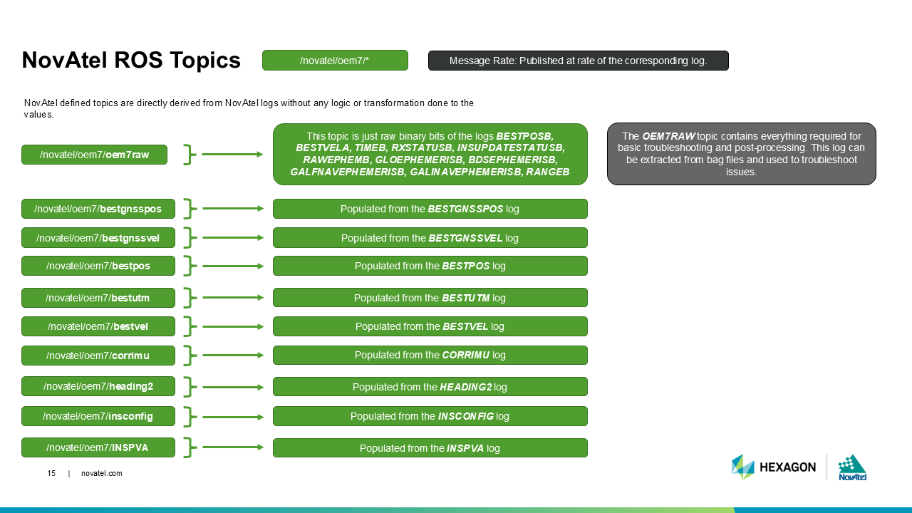
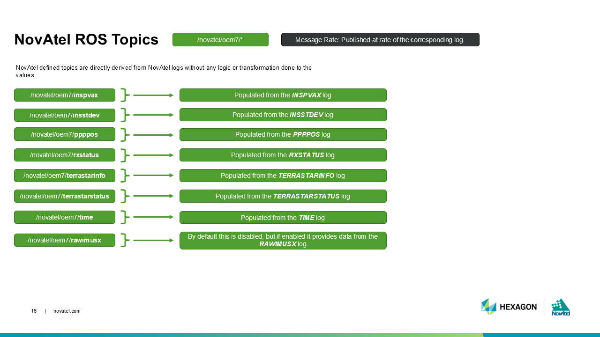
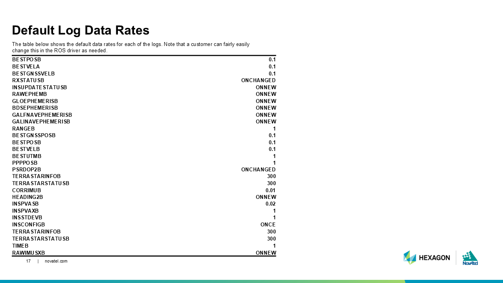

